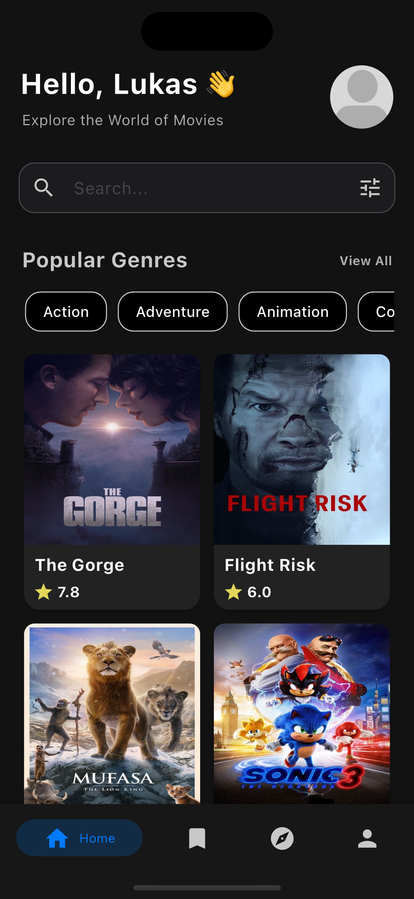
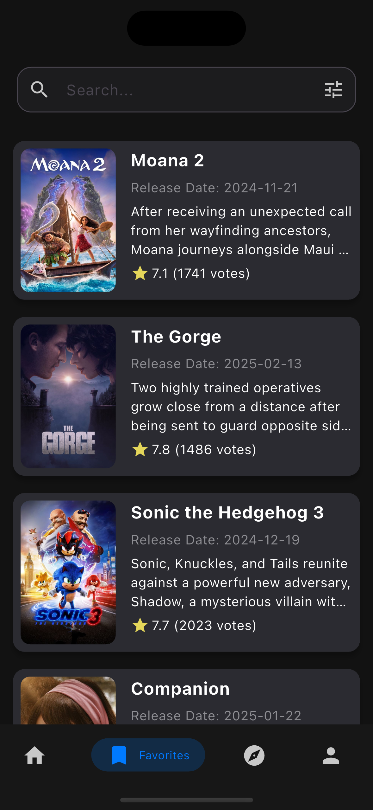
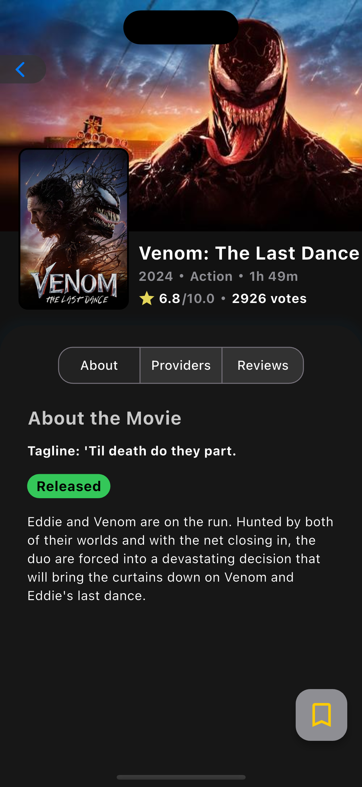
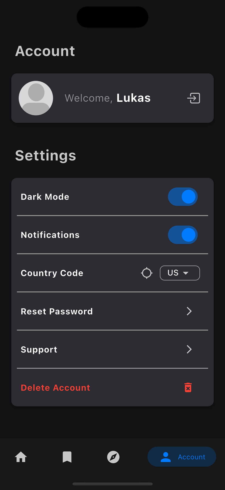
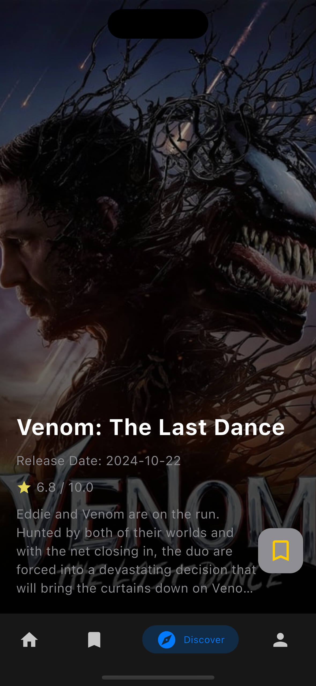

# Movissance - Movie Recommendation App

Welcome to **Movissance**, the ultimate movie recommendation app! This app helps you discover the best movies based on your preferences.

## Features

- **Personalized Recommendations**: Get movie suggestions based on your taste.
- **Detailed Movie Information**: Learn more about plot, cast, and ratings.
- **User-Friendly Interface**: Easy to navigate and use.
- **Cross-Platform**: Available for iOS, Android, Web, Windows, macOS, and Linux.

## Installation

### Prerequisites

- Flutter SDK
- Dart SDK

### Steps

1. Clone the repository:
    ```sh
    git clone https://github.com/L4XB/red_line
    ```

2. Navigate to the project directory:
    ```sh
    cd red_line
    ```

3. Install dependencies:
    ```sh
    flutter pub get
    ```

4. Get your API Key from https://www.themoviedb.org/ and enter it into the config.dart File.


## Firebase Setup

This project requires Firebase. To set up Firebase:

1. Install the [FlutterFire CLI](https://firebase.flutter.dev/docs/cli/).
2. Run `flutterfire configure` to generate the `firebase_options.dart` file.
3. Add the following files to the project:
   - `google-services.json` (Android)
   - `GoogleService-Info.plist` (iOS/macOS)

## Usage

Start the app with the following command:
    ```
    flutter run
    ```

## Folder Structure

- `lib/`: Contains the app's source code.
- `assets/`: Contains images, animations, and other resources.
- `test/`: Contains test cases for the app.
- `ios/`, `android/`, `web/`, `windows/`, `macos/`, `linux/`: Platform-specific files.

## Contributing

Contributions are welcome! Please create a pull request or open an issue to report bugs or suggest new features.

## License

This app is licensed under the MIT License. For more information, see the LICENSE file.

## Screenshots

Here are some screenshots of the app:

- **Home Screen**  
  

- **Favourites Screen**  
  

- **Movie Details Screen**  
  

- **Profile Screen**  
  

- **Swiper Screen**  
  

## Contact

For questions or suggestions, please contact [support.movissance.movies@lukasbuck.com](mailto:support.movissance.movies@lukasbuck.com).

---

Thank you for using **Movissance**! We hope you discover great movies.